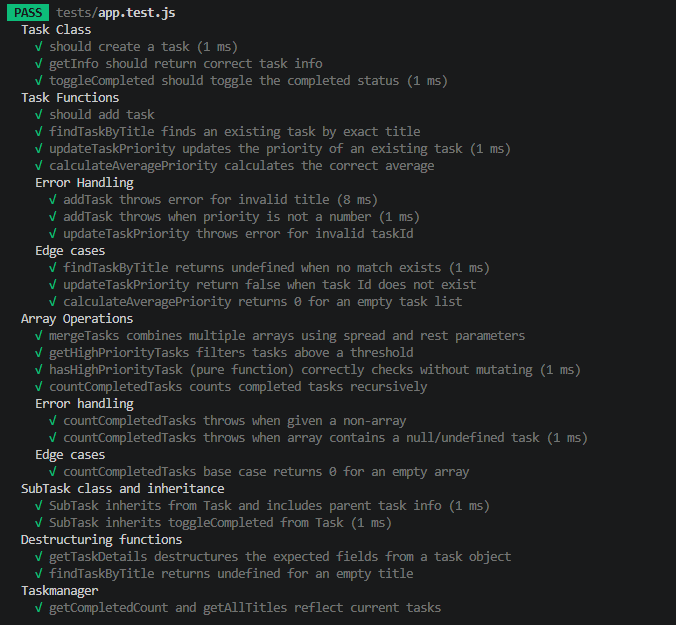
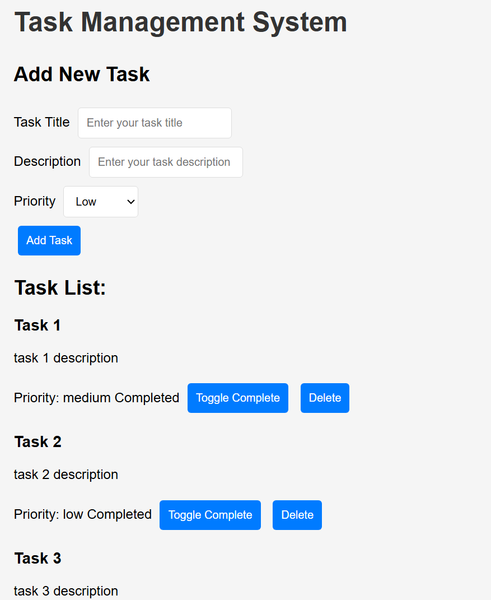
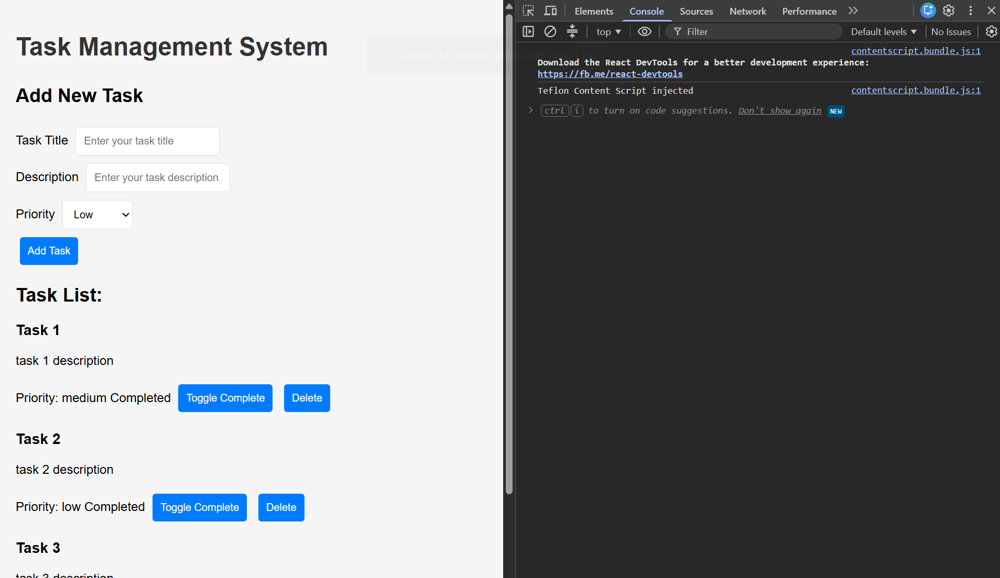
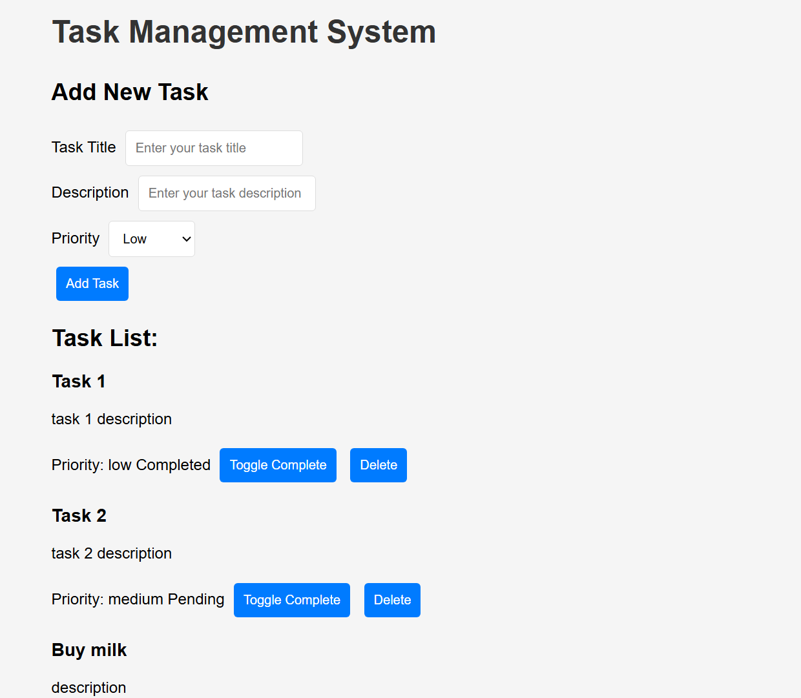

# Task Manager - Debug Capstone

## Overview

- A task management application built to debug and complete a partially broken JavaScript codebase.
- Supports creating, completing, and deleting tasks, with persistent storage via localStorage and full Jest test coverage.

## Errors Found

See [`issues-identified.pdf`](./issues-identified.pdf) for the complete breakdown by category (variables and operators, control flow, functions, OOP and Classes, Modern JavaScript, DOM and Events, Storage and JSON, Error Handling, Testing)

## Fixes Implemented

1. Replaced all var with let/const and fixed implicit globals
2. Corrected all == to ===, fixed off-by-one and infinite loop bugs
3. Added missing parameters, base case for recursion, and input validation
4. Converted manual loops to array methods (map/filter/reduce/find/some)
5. Fixed Task/SubTask class issues including missing super() call
6. Added destructuring, spread/rest operators, and template literals throughout
7. Implemented JSON.stringify/parse and working localStorage save/load
8. Rebuilt DOM selectors, added 5+ event listeners with event delegation
9. Added try-catch blocks around risky operations (storage, DOM handlers)
10. Converted all files to ES6 modules with proper import/export

## Features Added

1. Task priority filtering and statistics dashboard (total/completed/average priority)
2. Event delegation for task actions (complete/delete)
3. Persistent storage — tasks survive page reloads
4. Comprehensive Jest test suite (20+ tests, edge cases, error handling)

## How to Run
1. clone the repo locally using `git clone https://github.com/Umuzi-skillslab/task-management-appplication-richardcodez.git`
2. navigate to proect directory
3. open uisng vs code
4. run `npm install`
5. right click and open [`index.html`](./index.html) using live server

## How to Run Tests

- run `npm install` if have not already done so
- run `npm test` to test

## Test Results

All tests should pass (see screenshot below)

## Screenshots

### App running: 

### Console, no errors:

### Jest tests:

### DOM manipulation:

## Reflection

- The most challenging bug was the missing `super()` call in the `SubTask` class — since `SubTask extends Task`, JavaScript requires `super()` to run before `this` can be accessed, and the error message wasn't immediately about why.

- Debugging the recursive `countCompletedTasks` function was also instructive. Without a base case, calling it on the task list would throw an error once the index exceeded the array length, since it kept trying to read `.completed` off an undefined element. This reinforced that a recursive function needs an explicit stopping condition defined up front, not just correct logic for the "keep going" case — otherwise it's not really recursion, it's just a loop waiting to crash.

- Another useful debugging exercise was tracing an argument-order mismatch between `addTask` and `TaskManager.addNewTask` after the `Task` class constructor changed to accept an `id` parameter. A leftover unused parameter in `addTask` caused every argument passed by `TaskManager` to shift into the wrong slot, producing confusing type-validation errors that didn't obviously point back to the real cause. It was a good reminder to check function signatures carefully whenever a class constructor changes, since JavaScript won't warn you about mismatched argument counts at call time.
